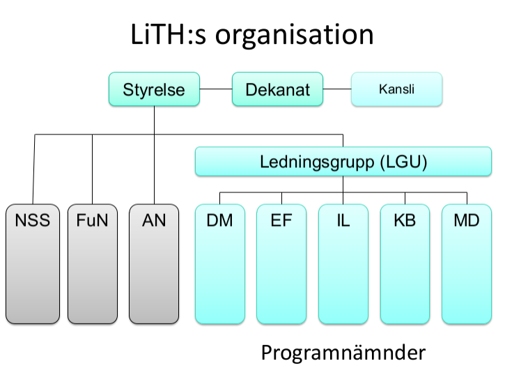
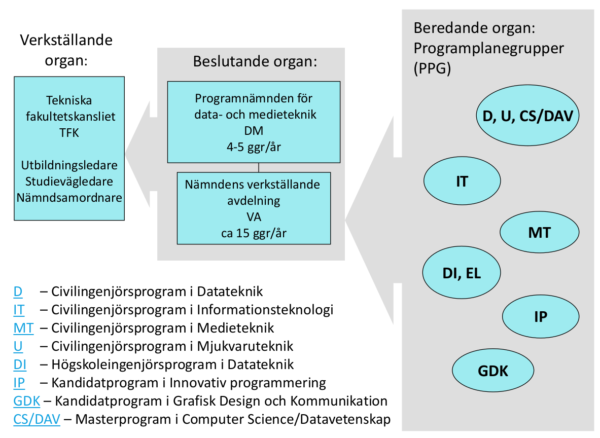
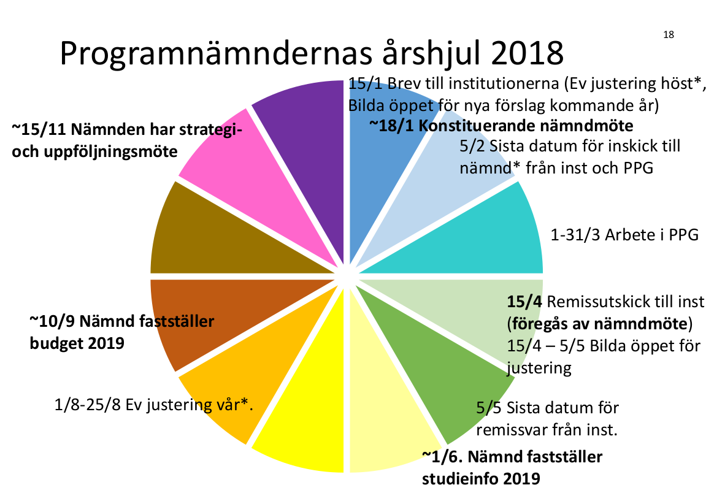

LiTHs organization
==================

    LiTH organization chart
    
Ledningsgruppen för grundutbildning vid LiTH
--------------------------------------------

Består av:

* Dekan samt prodekan för grundutbildning
* Kanslichef för Tekniska fakultetskansliet, TFK
* Ordförande programnämnderna
* Utbildningsledare programnämnderna
* Linteks utbildningsbevakare
* Ordförande Nämnden för skolsamverkan

Möte 1 gång/vecka

Programnämnder vid LiTH
-----------------------

På LiTH tillhör varje program en programnämnd:

* DM Programnämnden för data- och medieteknik
* EF Programnämnden för elektroteknik, fysik och matematik
* IL Programnämnden för industriell ekonomi och logistik
* KB Programnämnden för kemi, biologi och bioteknik
* MD Programnämnden för maskinteknik och design

Övriga nämnder vid LiTH
-----------------------

* Anställningsnämnden
* Nämnden för skolsamverkan
* Forskarutbildningsnämnden

Programnämndens ledamöter
-------------------------

* Näringslivsrepresentanter som representerar
  sektorn, inte sitt företag
* Verksamhetsföreträdare (lärare/forskare) som
  representerar Teknisk fakultet, inte sin institution
* Studenter[*]_ som representerar studenter på Teknisk
  Fakultet, inte sin utbildning 

.. [*] Lintek (utbildningsbevakare) och SnOrdf:ar (Sektionernas Studienämndsordförande)

Programnämndens stödfunktioner
------------------------------

* Studievägledare (vägleder programmens studenter)
* Nämndsamordnare (samordnar nämndens möten
  samt schemalägger)
* Utbildningsledare (administrerar
  Studieinformationen/Studiehandboken, är del av LiTHs
  ledningsgrupp för grundutbildning, ansvarar för  
  nämndens internationalisering)

Nämndernas uppdrag
------------------

* Vidareutveckla och förnya utbildningarna i enlighet
  med fakultetsstyrelsens riktlinjer, med beaktande av
  forskningens framsteg, samhällets och yrkeslivets
  krav samt studenternas behov.
* Hos fakultetsstyrelsen föreslå de större åtgärder i
  fråga om utbildningen som är påkallade, inklusive
  större ändringar i utbildningsplanen som påverkar
  utbildningens mål. Nya profiler och inriktningar
  liksom avveckling av desamma rapporteras
  fortlöpande till dekanus.
* Föreslå fakultetsstyrelsen dimensionering av
  utbildningarna.
* Föreslå fakultetsstyrelsen antagningstal inför
  antagning till utbildningarna.
* Säkerställa att kurser och andra utbildningsmoment
  som ingår i programmen samordnas pedagogiskt och
  studieorganisatoriskt.
* Fastställa lässchema och tentamensschema.
* Ansvara för att verksamheten planeras, följs upp,
  utvärderas och kvalitetssäkras utgående från
  universitetets och fakultetens processer och system
  för kvalitetssäkring och kvalitetsutveckling.
* Lämna fakultetsstyrelsen underlag för
  framställningar till regering och riksdag.
* Lämna fakultetsstyrelsen underlag för budget.
* Lämna fakultetsstyrelsen underlag för årlig
  resultatredovisning.
* Ansvara för underlag till information om
  utbildningen till presumtiva studerande, till
  underliggande utbildningssystem och till
  arbetsmarknaden.
* Ansvara för internationaliseringsarbetet inom
  nämndens område enligt fakultetsstyrelsens mål.
* Bidra till fakultetens handlingsplaner och
  genomförande av aktiviteter i syfte att främja
  jämställdhet och lika villkor.

Beslut, konkreta exempel
------------------------

* Programspecifik:

  * Utbildningsplan (beskriver programmen)
  * Programplan (anger de kurser programmet innehåller)
  * Kursplan (anger lärandemål, innehåll, examination per kurs)
  * www.liu.se/studieinfo (alla beslutade dokument ovan)
  
* Beslut om budgetunderlag
* Beslut att delegera vidare

    Beredande, Beslutande och Verkställande organ
    
Programplanegrupp, PPG
----------------------

* Utses av nämnden och består av:

  - lärare
  - studenter/SnOrdf:ar
  - studievägledare
  - nämndsamordnare
  - utbildningsledare
  
* Gruppen ser till att programplanen håller ihop och
  innehåller ”rätt” saker
* Följer hur kurser fungerar
  - Sektionsutvärderingar
  - Elektroniska kursutvärderingar (KURT)
  - Examinationsfrekvens
* Följer hur programmet fungerar:
  - Kvalitetssystemet
* Föreslår/utreder förändringar i kurser / nya kurser
* Kursers placering på programmet
* ...

Verkställande avdelningen, VA
-----------------------------
* Består av:

  - Ordförande i nämnden
  - Lintek, utbildningsbevakare

* Beslutar ärenden som:

  - Studentärenden
  - Löpande kurs och programplaneförändringar
  - Löpande budgetfrågor

    
  
